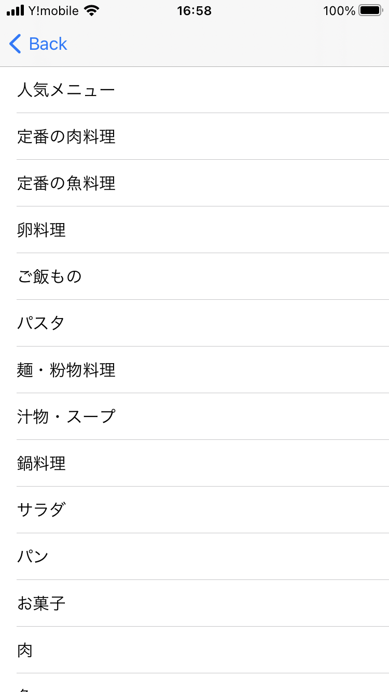
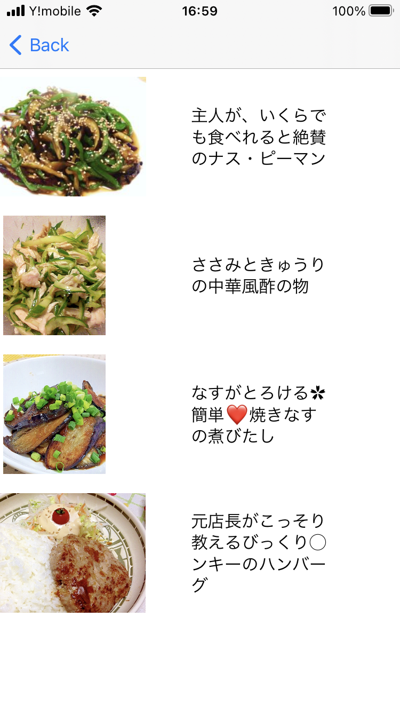
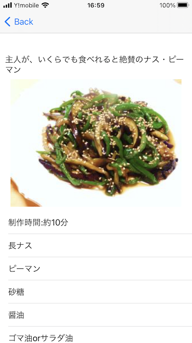

# アプリ名
recipeResearcher
# 対象OS
iOS 14.5
# 開発環境
Xcode Version 12.5 (12E262)
# 言語
Swift
# 機能概要

アプリケーションを使用する時、表で表示された任意のカテゴリを選択することで、そのカテゴリに対応した人気ランキングの上位4つのレシピを表示する。

レシピを選択すると、レシピで使用する食材、所要時間などの情報が表示され、指定された箇所をタップすることで、レシピを掲載しているWebページを表示する。

# 画面概要
起動した時に表示される画面。 

タップしてスタートを押すことで、次のレシピのカテゴリを一覧で表示する画面に遷移する

起動画面から遷移する画面。

レシピのカテゴリを表で表示しており、行をタップすることでその行に対応したカテゴリのレシピ一覧を表示する画面に遷移する。

レシピカテゴリ表示画面から遷移する画面。

遷移前の画面でタップされたカテゴリに対応したレシピの画像とタイトルが表示される。

各行をタップすることでタップされた行に対応するレシピの詳細情報を表示する画面に遷移する。

レシピリスト表示画面から遷移する画面。

遷移前の画面でタップされたレシピに対応したレシピの詳細情報が表示される。

材料リストの一番下の行にある「タップしてレシピのページへ」と書かれたセルをタップすることでレシピが掲載されているWebサイトのページを表示する画面に遷移する。

レシピ詳細表示画面から遷移する画面

遷移前の画面で表示されていたレシピが掲載されているWebページを表示する。

# 使用しているAPI
楽天レシピカテゴリAPI
楽天レシピカテゴリランキングAPI

# コンセプト

食事の献立を考えることが面倒な時に大雑把に食べたいカテゴリさえ選べばおすすめのレシピをサジェストする

# こだわったポイント

何を操作すれば良いかわかりやすいように不必要な情報を一切UIに入れないようにした。

# アドバイスして欲しいポイント

クラス分けが適切かどうか

実用的でかつ見栄えの良いUIの設計

# デザインに関して見て欲しいポイント

実用的でかつ見栄えの良いUIの設計

タイトル画面のデザイン方法

# 自己評価
時間がなかったので2日で作成せざるを得なかったのだが、機能面に関してはAPIを用いるなど、最低限満足できる出来となった。

しかし、時間がなかったことで、機能の実装を優先したため、デザインに関しては凄惨な出来となった。

最低限の使用に耐えるように比較的操作が直感的にわかりやすいUIを用いるようにはしたので、見栄えはともかく、操作性はある程度担保されていると考える。

