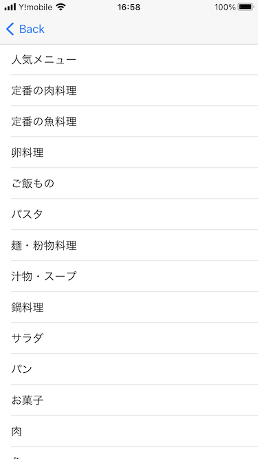

# アプリ名
recipeResearcher
# 対象OS
iOS 14.5
# 開発環境
Xcode Version 12.5 (12E262)
# 言語
Swift
# 機能概要

# 画面概要
起動した時に表示される画面。 

タップしてスタートを押すことで、次のレシピのカテゴリを一覧で表示する画面に遷移する

起動画面から遷移する画面。

レシピのカテゴリを表で表示しており、行をタップすることでその行に対応したカテゴリのレシピ一覧を表示する画面に遷移する。

レシピカテゴリ表示画面から遷移する画面。

遷移前の画面でタップされたカテゴリに対応したレシピの画像とタイトルが表示される。

各行をタップすることでタップされた行に対応するレシピの詳細情報を表示する画面に遷移する。

レシピリスト表示画面から遷移する画面。

遷移前の画面でタップされたレシピに対応したレシピの詳細情報が表示される。

材料リストの一番下の行にある「タップしてレシピのページへ」と書かれたセルをタップすることでレシピが掲載されているWebサイトのページを表示する画面に遷移する。

レシピ詳細表示画面から遷移する画面

遷移前の画面で表示されていたレシピが掲載されているWebページを表示する。

# 使用しているAPI

# コンセプト

# こだわったポイント

# アドバイスして欲しいポイント

# デザインに関して見て欲しいポイント

# 自己評価

